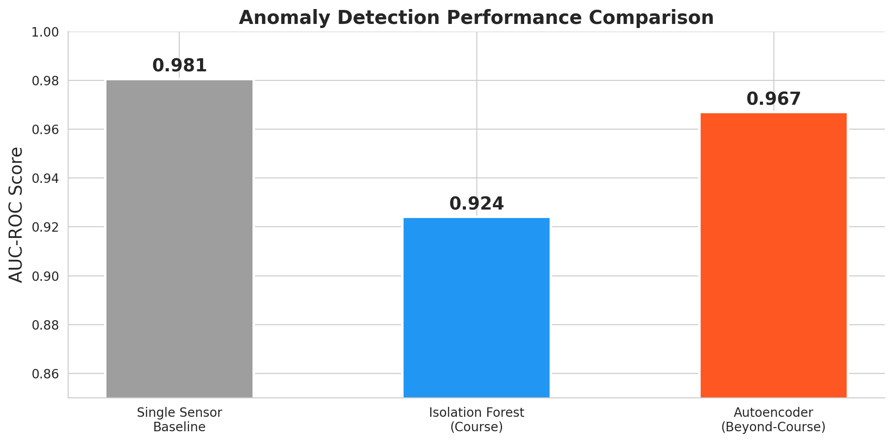

# Predictive Maintenance via Anomaly Detection on Turbofan Engine Sensor Data

> **CSCE 676 — Data Mining and Analysis · Spring 2026 · Texas A&M University**
> Author: Paurushmani Singh

[](https://youtu.be/AAe5ynCCAnM)

Aircraft engines do not fail without warning — they degrade gradually, leaving a fingerprint in their sensor readings. The challenge is that the fingerprint is buried in noise, spread across 21 sensors, and varies engine-to-engine. This project asks whether we can detect engine degradation onset directly from sensor data **without ever seeing a labelled failure**.

Using NASA's C-MAPSS (FD001) run-to-failure simulation, we build and compare three detectors — Isolation Forest, K-Means + DBSCAN clustering, and a deep autoencoder trained only on healthy cycles. The Isolation Forest correctly localises the most-anomalous cycle to the critical phase (RUL ≤ 30) on **all 20 / 20** held-out test engines after we fix a 15-cycle rolling-window warmup artefact that was inflating early-life anomaly scores in our first pass. And we surface a humbling cross-cutting finding: a single well-chosen sensor used as a univariate threshold (AUC = 0.98) is **competitive with every learned detector** on this single-regime dataset.

> 👉 **Start here:** [`main_notebook.ipynb`](main_notebook.ipynb)
> 🎥 **Project video:** https://youtu.be/AAe5ynCCAnM

---

## Research questions

1. **RQ1 (course technique).** Does multivariate anomaly detection — Isolation Forest — reliably flag degradation onset, and how does it compare to a one-sensor univariate baseline?
2. **RQ2 (course technique).** Can purely unsupervised clustering (K-Means, DBSCAN) recover the latent Healthy / Degrading / Critical health states *without* any RUL labels?
3. **RQ3 (beyond-course technique).** Does a deep autoencoder trained only on healthy cycles detect degradation onset more accurately than Isolation Forest?

The full motivation, methods, and answers are in [`main_notebook.ipynb`](main_notebook.ipynb).

---

## Results at a glance

| Method | Technique type | AUC-ROC | Failure data needed at fit time? |
|---|---|---:|:---:|
| `sensor_11` univariate baseline | Univariate threshold | **0.9791** | No |
| LOF (novelty mode, healthy fit) | Course | **0.9753** | No (contamination prior) |
| Autoencoder (3-d bottleneck) | **Beyond-course** | 0.9577 | **No (healthy cycles only)** |
| Isolation Forest | Course | 0.9434 | No (contamination prior) |

**Detection timing.** After fixing a rolling-window warmup artefact, the peak Isolation Forest anomaly score lands at RUL ≤ 30 on **20 of 20** held-out test engines — every test engine is correctly localised to its critical phase.

**Clustering (RQ2).** K-Means with k = 3 recovers the latent health states at mean cluster purity 0.67, NMI 0.34, ARI 0.25 against the RUL-derived ground truth — moderate agreement achieved without labels. DBSCAN goes further: **100 % of its noise points are degraded cycles**. Recall is low (only the most extreme degradations get flagged) but precision is essentially perfect, making DBSCAN a strong unsupervised triage signal.

---

## Data

**Source.** [NASA C-MAPSS Turbofan Engine Degradation Simulation Dataset](https://data.nasa.gov/dataset/cmapss-jet-engine-simulated-data) (subset FD001).
**License.** U.S. Government Public Domain.
**Shape.** 100 simulated engines, 20,631 total cycles. Per cycle: 3 operational settings + 21 sensors. Run-to-failure trajectories with derived RUL.

The dataset is committed at `data/6. Turbofan Engine Degradation Simulation Data Set/` (the FD001 train/test files plus the original NASA archive and accompanying PDF). It's small enough (~12 MB) that committing it makes the repo immediately runnable end-to-end. If you'd rather grab a fresh copy, the upstream archive is at [https://phm-datasets.s3.amazonaws.com/NASA/6.+Turbofan+Engine+Degradation+Simulation+Data+Set.zip](https://phm-datasets.s3.amazonaws.com/NASA/6.+Turbofan+Engine+Degradation+Simulation+Data+Set.zip).

**Preprocessing (in-notebook).** Drop 10 constant columns (3 operational settings + 7 sensors that are flat under FD001's single operating regime). Compute Remaining Useful Life (RUL = max_cycle - current_cycle per engine). Engineer 28 features = 14 informative sensors × {15-cycle rolling mean, 15-cycle rolling std}. Min-Max scale to [0, 1] using train statistics only (engine-level 80/20 split avoids row-level leakage).

---

## How to reproduce

The notebooks were developed locally on Python 3.9 against a virtualenv, but the code is plain `pip install` and Colab-compatible.

```bash
# Clone
git clone https://github.com/paurushmani/CSCE676_Project.git
cd CSCE676_Project

# Set up environment
python3 -m venv .venv
source .venv/bin/activate
pip install -r requirements.txt

# Place the C-MAPSS dataset (see Data section above) into:
#   data/6. Turbofan Engine Degradation Simulation Data Set/

# Run notebooks in order
jupyter notebook checkpoints/checkpoint_1.ipynb   # Dataset selection + EDA
jupyter notebook checkpoints/checkpoint_2.ipynb   # Research questions + prototypes
jupyter notebook main_notebook.ipynb              # Final curated narrative
```

Or in Colab — `requirements.txt` was generated to be Colab-compatible; upload the notebooks and the data archive, then run end-to-end.

The autoencoder trains in ~2 minutes on CPU and seconds on GPU.

---

## Key dependencies

| Package | Version | Used for |
|---|---|---|
| python | 3.9 | Runtime |
| numpy | 2.0.2 | Arrays / numerics |
| pandas | 2.3.3 | DataFrame manipulation |
| scikit-learn | 1.6.1 | IF, LOF, K-Means, DBSCAN, PCA, metrics |
| torch | 2.8.0 | Autoencoder (RQ3) |
| matplotlib | 3.9.4 | Plotting |
| seaborn | 0.13.2 | Plot styling |

Full pinned list in [`requirements.txt`](requirements.txt).

---

## Repo structure

```
CSCE676_Project/
├── README.md                       ← you are here
├── main_notebook.ipynb             ← 👈 final curated deliverable (start here)
├── requirements.txt                ← pinned deps for reproducibility
├── checkpoints/
│   ├── checkpoint_1.ipynb          ← Checkpoint 1 — dataset selection + EDA
│   └── checkpoint_2.ipynb          ← Checkpoint 2 — RQs + method prototypes
├── assets/                         ← figures used in the README and video
│   ├── fig1_degradation_signal.png
│   ├── fig2_pca_health_states.png
│   ├── fig3_autoencoder_detection.png
│   ├── fig4_comparison.png
│   └── fig5_architecture.png
├── data/                           ← C-MAPSS dataset (committed; ~12 MB)
├── src/
│   └── build_main_notebook.py      ← reproducible builder for main_notebook.ipynb
└── .gitignore
```

---

## Headline figure



*Per-method AUC-ROC on held-out test engines (units 81–100). Trained on engines 1–80 only.*

---

## Citations

- A. Saxena, K. Goebel, D. Simon, and N. Eklund, "Damage Propagation Modeling for Aircraft Engine Run-to-Failure Simulation," *Proc. 1st Int. Conf. on Prognostics and Health Management (PHM)*, 2008.
- F. T. Liu, K. M. Ting, and Z.-H. Zhou, "Isolation Forest," *Proc. 8th IEEE Int. Conf. on Data Mining (ICDM)*, 2008.
- M. Ester, H.-P. Kriegel, J. Sander, and X. Xu, "A Density-Based Algorithm for Discovering Clusters in Large Spatial Databases with Noise," *Proc. 2nd Int. Conf. on Knowledge Discovery and Data Mining (KDD)*, 1996.
- D. P. Kingma and J. Ba, "Adam: A Method for Stochastic Optimization," *arXiv:1412.6980*, 2014.

---

*Built for CSCE 676, but if you're a recruiter or hiring manager landing here — welcome. The story is in [`main_notebook.ipynb`](main_notebook.ipynb), and I'd be glad to walk you through it.*
